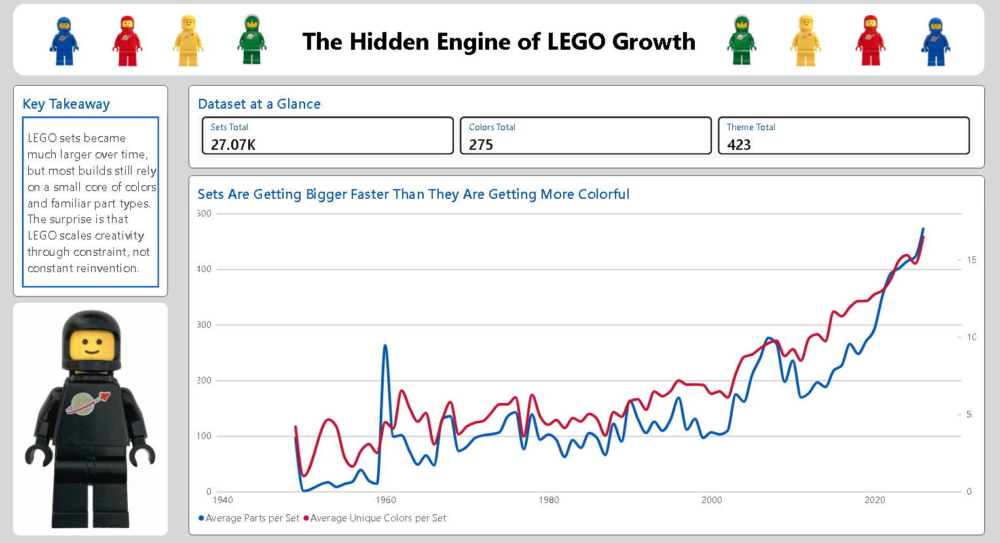
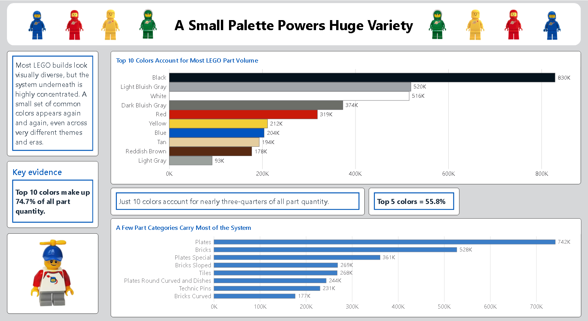
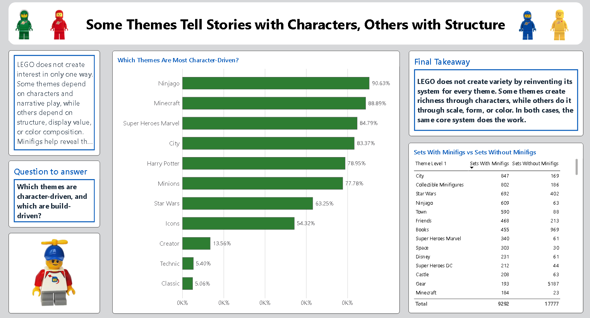

# Dashboard Explanation: The Hidden Engine of LEGO Growth

This document explains only the final dashboard: what appears on each side of each page, and the key insight each page communicates.

## Page 1 - The Hidden Engine of LEGO Growth

### Left side
- Key Takeaway text block with the core message of the report.
- Small KPI summary cards (sets, themes, colors) to establish scale quickly.

### Right side
- Hero dual-line chart: average parts per set vs average unique colors per set over time.

### Bottom
- Source citation: Rebrickable LEGO Database.

### Insight from Page 1
- LEGO sets have grown strongly in size over time.
- Color diversity also increased, but at a slower rate.
- The story starts with a gap: complexity rose faster than visual diversity.

## Page 2 - A Small Palette Powers Huge Variety

### Left side
- Short narrative paragraph explaining concentration in the LEGO system.
- Key evidence card highlighting that top colors dominate total part volume.

### Right side (top)
- Horizontal bar chart of top colors by total part quantity.
- Visual emphasis on how few colors account for most usage.

### Bottom (supporting visual)
- Horizontal bar chart of top part categories by usage.
- Reinforces that a small structural core powers most builds.

### Insight from Page 2
- LEGO variety is built on concentration, not endless expansion.
- A small group of colors carries most of the ecosystem.
- A few part categories appear repeatedly across many different sets and themes.

## Page 3 - Some Themes Tell Stories with Characters, Others with Structure

### Left side
- Narrative text introducing the human angle.
- Framing question: which themes are character-driven vs build-driven?

### Right side
- Hero chart comparing selected theme groups using minifig-based metrics
  (for example: percent of sets with minifigs, or average minifigs per set).

### Bottom
- Closing takeaway text that connects character richness and structural richness.

### Insight from Page 3
- Theme richness is not one-dimensional.
- Some themes create value through characters and narrative play.
- Other themes create value through build scale, shape, and design composition.
- Both approaches still rely on the same LEGO core system.

## Combined Dashboard Insight

Across all three pages, the dashboard shows one consistent conclusion:

- LEGO grows creativity through constraint.
- Set scale and theme variety expand over time.
- But the foundation remains stable: recurring colors, recurring part categories, and reusable design logic.

This is why the dashboard is a story report, not just a collection of charts.